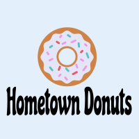

# Final Project-Hometown Product Shop

## Description:
For the final project of the course, we were tasked with creating a collaborative MERN stack single-page application, featuring a scalable MongoDB back end, a GraphQL API, and an Express.js and Node.js server with a React front end. We were also required to implement user authentication with JWT to build a user-focused platform. 

Our group decided to create an E-Commerce Platform for a local product shop: Hometown Products. Our application allows users to browse the product offerings of the store (which includes a photo of each product along with its price, description and customer reviews) without signing up or logging into the platform. If a visitor to the site would like to purchase any product(s) or post their review of one of the products, they will need to create an account and be logged into the platform. 

## Installation Instructions:
First, clone this repository. Navigate to the directory containing repository in your terminal. 

1. In your terminal, enter "npm install" to install all of the application's dependencies. 
2. *OPTIONAL* In your terminal, enter "npm run seed" to run the seed data. 
7. In your terminal, enter "npm run develop" to start the server and deploy the application.

## Built With:
* Javascript
* [Node JS](https://nodejs.org/en/)
* [Express](https://www.npmjs.com/package/express)
* [React](https://www.npmjs.com/package/react)
* [Mongo DB](https://www.npmjs.com/package/mongodb)
* [GraphQL](https://graphql.org/)
* [JWT](https://www.npmjs.com/package/jsonwebtoken)

## Deployed Links:
* [Link to GitHub Repo](https://github.com/StephanieHeins/ProductShop)
* [Link to Heroku Deployed Application](https://vast-harbor-81037.herokuapp.com)

## Preview of Working Application:

## How to Contribute:
If you'd like to contribute to this project please send an email to eegraham4@gmail.com. Thank you for your interest!

## How to Test the Application:
Please see the installation instructions above. Also, feel free to test the application via the Heroku link. 

## License:

Copyright 2021 Steven Chung, Troy Atkinson, Emma Graham, Stephanie Heins

Permission is hereby granted, free of charge, to any person obtaining a copy of this software and associated documentation files (the "Software"), to deal in the Software without restriction, including without limitation the rights to use, copy, modify, merge, publish, distribute, sublicense, and/or sell copies of the Software, and to permit persons to whom the Software is furnished to do so, subject to the following conditions:

The above copyright notice and this permission notice shall be included in all copies or substantial portions of the Software.

THE SOFTWARE IS PROVIDED "AS IS", WITHOUT WARRANTY OF ANY KIND, EXPRESS OR IMPLIED, INCLUDING BUT NOT LIMITED TO THE WARRANTIES OF MERCHANTABILITY, FITNESS FOR A PARTICULAR PURPOSE AND NONINFRINGEMENT. IN NO EVENT SHALL THE AUTHORS OR COPYRIGHT HOLDERS BE LIABLE FOR ANY CLAIM, DAMAGES OR OTHER LIABILITY, WHETHER IN AN ACTION OF CONTRACT, TORT OR OTHERWISE, ARISING FROM, OUT OF OR IN CONNECTION WITH THE SOFTWARE OR THE USE OR OTHER DEALINGS IN THE SOFTWARE.
